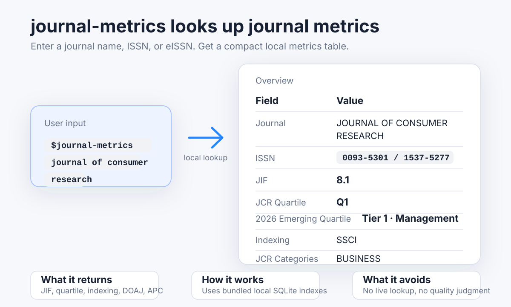

# journal-metrics

[English](./README-EN.md) | [中文](./README.md)

`journal-metrics` is a local agent skill for clean, source-bounded journal lookups. It queries bundled SQLite indexes and returns a compact table covering JIF, JCR quartiles, indexing, DOAJ records, and selected publisher submission metrics without inventing missing values.



## Features

- Query multiple local SQLite indexes through one entrypoint.
- Return a compact table focused on the fields most relevant to journal selection.
- Keep source boundaries explicit instead of filling missing fields by guesswork.

## Installation

In an agent chat window (Codex/ZCode/Claude Code/OpenCode/Kimi Code, etc.), run the following command:

```text
Please install hiDaDeng/journal-metrics for me.
GitHub: https://github.com/hiDaDeng/journal-metrics
```

If you prefer a terminal:

```
npx skills add hiDaDeng/journal-metrics
```


## Usage

Typical agent prompt:

```text
$journal-metrics Marketing Science
```

Run

```
**Overview**

|     Field    |       Value       |
|--------------|-------------------|
|   Journal    |MARKETING SCIENCE  |
|    ISSN      |0732-2399/1526-548X|
|     JIF      |       5.2         |
| JCR Quartile |        Q2         |
| 2026新锐分区  |    1 区 · 管理学    |
|  Indexing    |       SSCI        |
|JCR Categories|     BUSINESS      |

[hiDaDeng/journal-metrics] Please re-check critical details before submission.
```


## Project Structure

```text
journal-metrics/
├── SKILL.md
├── agents/openai.yaml
├── scripts/
└── assets/
    ├── journal-metrics.sqlite
    ├── doaj.sqlite
```

## File Guide

- `SKILL.md`  
  Core operating instructions for the skill.

- `agents/openai.yaml`  
  UI metadata for display name, short description, and default prompt.

- `scripts/query.py`  
  Main query entrypoint for lookup, aggregation, and output formatting.

- `scripts`  
  Python scripts used by the skill.

- `assets/journal-metrics.sqlite`  
  Main lookup database built from local JCR and emerging-quartile source tables.

- `assets/doaj.sqlite`  
  Fast lookup database generated from the DOAJ CSV snapshot.


## Notes

- The repository is still under active construction.
- Please re-check critical details before submission.
