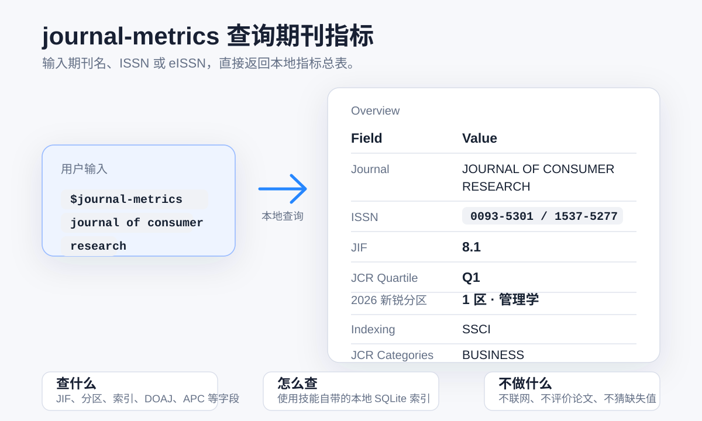

# journal-metrics

[English](./README.md) | [中文](./README-zh.md)

**期刊指标**

选刊指标很容易变乱：不同来源的分区和周期被混在一起，缺失字段被猜测补齐，出版集团页面上的信息也常被误当成 JCR 口径。

`journal-metrics` 是一个面向智能体的本地期刊查询技能。它通过打包的 SQLite 索引返回干净、紧凑、来源边界清楚的总表，覆盖 JIF、JCR 分区、收录索引、DOAJ 信息，以及部分出版集团投稿指标，不自行补写缺失值。



## 特性

- 通过一个入口查询多个本地 SQLite 索引。
- 返回一个紧凑总表，优先展示最影响选刊判断的字段。
- 保持不同来源的边界，不用猜测补齐缺失字段。

## 安装

在 agent 对话框（Codex、OpenCode、Claude Code、Kimi Code 等）中执行命令：

```text
安装 GitHub 仓库 hiDaDeng/journal-metrics
```

## 使用

在智能体对话中，常见调用方式如下：

```text
$journal-metrics Computers in Human Behavior
```

命令行直接查询：

```bash
python3 scripts/query.py "Computers in Human Behavior"
python3 scripts/query.py "Computers in Human Behavior" --json
```

## 返回结果

默认输出为一个连续总表，通常包含：

- 期刊名与 ISSN
- JIF
- JCR Quartile
- 2026 新锐分区
- 收录索引（`SCI` / `SCIE` / `SSCI` / `ESCI` / `AHCI`）
- JCR Categories
- 排名（如本地库可用）
- DOAJ 字段（如命中）
- 出版集团指标（如命中）

状态处理规则：

- `found`：直接返回结果
- `ambiguous`：返回候选期刊并等待进一步指定
- `not_found`：有候选时默认自动采用第 1 条；否则返回本地数据未收录

## 项目结构

```text
journal-metrics/
├── SKILL.md
├── README.md
├── README-zh.md
├── agents/
│   └── openai.yaml
├── scripts/
│   ├── query.py
│   ├── build_index.py
│   ├── build_doaj.py
│   ├── sync_publishers.py
│   ├── sync_wiley.py
│   └── sync_frontiers.py
└── assets/
    ├── journal-metrics.sqlite
    ├── doaj.sqlite
    └── publishers/
        ├── wiley.sqlite
        └── frontiers.sqlite
```

## 文件说明

- `SKILL.md`  
  技能主说明，定义智能体的执行规则。

- `README.md`  
  英文版项目说明。

- `README-zh.md`  
  中文版项目说明。

- `agents/openai.yaml`  
  界面名称、简介与默认提示词等元数据。

- `scripts/query.py`  
  主查询入口，负责检索、聚合与输出格式化。

- `scripts/build_index.py`  
  用本地 JCR 工作簿和 2026 新锐分区工作簿构建 `journal-metrics.sqlite`。

- `scripts/build_doaj.py`  
  用 DOAJ 官方 CSV 快照构建 `doaj.sqlite`。

- `scripts/sync_wiley.py`  
  同步 Wiley 公开目录指标。

- `scripts/sync_frontiers.py`  
  同步 Frontiers 公开目录指标。

- `scripts/sync_publishers.py`  
  当前支持出版集团数据的批量同步入口。

- `assets/journal-metrics.sqlite`  
  主查询库，来源于本地整理后的 JCR 与新锐分区源表。

- `assets/DOAJ_journalcsv_20260711_2320_utf8.csv`  
  DOAJ 原始快照文件。

- `assets/doaj.sqlite`  
  由 DOAJ CSV 快照构建的快速查询库。

- `assets/publishers/wiley.sqlite`  
  由 Wiley 公开目录数据整理生成。

- `assets/publishers/frontiers.sqlite`  
  由 Frontiers 公开目录数据整理生成。

## 说明

- 仓库仍在建设中。
- 投稿前请再次核对关键信息。
